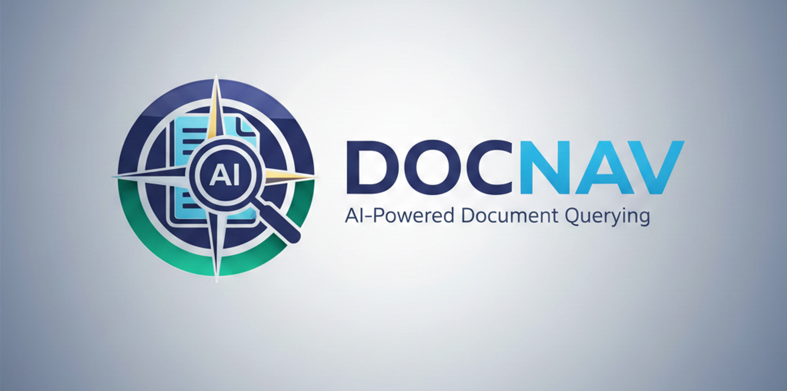

# DocNav: AI-Powered Document Querying with Citations



[](https://badge.fury.io/py/docnav)
[](https://pypi.org/project/docnav/)
[](https://pypi.org/project/docnav/)
[](https://pypi.org/project/docnav/)
[](https://github.com/Mukesh-Anand-G/DocNav)
[](https://github.com/Mukesh-Anand-G/DocNav)
[](https://github.com/Mukesh-Anand-G/DocNav/issues)


---

## 🧠 **"DocNav: Document-Centric AI Research Assistant"**

DocNav is a document-centric AI research assistant built to enable semantic querying and structured reasoning over large, unstructured document collections.

It supports ingestion of common enterprise and research formats including **PDF**, **DOCX**, **XLSX**, and **PPTX**. Rather than relying on keyword-based search, DocNav uses embedding-based retrieval, context-aware chunking, and LLM-driven reasoning to generate answers grounded in source documents.

## Core Capabilities

- Multi-format document ingestion (PDF, Word, Excel, PowerPoint)
- Semantic search using vector embeddings
- Chunk-level indexing for precise context retrieval
- Retrieval-Augmented Generation (RAG) pipeline
- Source-cited responses for traceability
- Scalable design for large document repositories

## Typical Use Cases

- Navigating technical documentation
- Research paper analysis
- Internal knowledge base querying
- Compliance, audit, and policy review
- Enterprise document intelligence

## How It Works (High-Level)

1. Documents are parsed and normalized into text
2. Content is split into semantically meaningful chunks
3. Chunks are embedded and stored in a vector database
4. User queries are embedded and matched via similarity search
5. Retrieved context is passed to an LLM for grounded response generation
6. Relevant source references are attached to each answer

## Design Goals

- Accuracy over verbosity
- Deterministic, traceable outputs
- Model-agnostic and backend-flexible
- Extensible ingestion and retrieval pipeline

DocNav is designed as a practical foundation for building document intelligence systems using modern NLP and retrieval techniques.


## 🚀 **"Below is an overview of the system in action"**

### **Installation (Because even geniuses need to start somewhere)**

```bash
# Basic installation - for the minimalists
pip install docnav

# Full installation - for the power users who want it all
pip install docnav[full]

# With OCR support - because scanned PDFs shouldn't be a problem
pip install docnav[full,ocr]

# Development installation - for my fellow tinkerers
pip install docnav[dev]
```

### **CLI Usage (Command line, because real engineers love the terminal)**

```bash
# Create a new corpus - your personal knowledge base
docnav new mydocs

# Add documents - feed me your knowledge
docnav add mydocs documents/ reports.pdf

# Query your documents - ask me anything
docnav query mydocs "What are the main findings?"

# Switch between AI models like changing suits
docnav query mydocs "Analyze the financial trends" --provider gemini --model gemini-2.5-flash
docnav query mydocs "Extract key insights" --provider claude --model claude-3-sonnet-20240229

# Quick query - no corpus needed, just pure intelligence
docnav quick document.pdf "Give me the executive summary"
```

### **Python API (For when you need to get programmatic)**

```python
from docnav import Corpus

# Create or load a corpus - your knowledge base
corpus = Corpus("mydocs")

# Add documents - feed me your knowledge
corpus.add(["document.pdf", "report.docx", "data.xlsx"])

# Ask questions - this is where the magic happens
answer = corpus.ask("What are the key business insights?")
print(answer.text)

# Access sources - because transparency matters
for source in answer.sources:
    print(f"Source: {source.metadata['file_name']}")
    print(f"Confidence: {source.score:.2f}")
    print(f"Content: {source.text[:200]}...")
```

## Beyond Search: Context-Aware Understanding

DocNav is designed to go beyond keyword matching by performing semantic analysis and context-aware retrieval across diverse document types.

---

## Multi-Format Document Support

DocNav provides native ingestion and parsing support for a wide range of commonly used document formats:

- **PDF** — Research papers, reports, contracts
- **DOCX** — Business documents, proposals, technical reports
- **XLSX / Excel** — Spreadsheets, financial models, analytical data
- **PPTX / PowerPoint** — Presentations, training decks, slide content
- **TXT / Markdown (MD)** — Documentation, notes, code-related text
- **CSV** — Structured data exports, logs, tabular datasets

Each format is processed using format-specific loaders to preserve structural and semantic integrity.

---

## Intelligent Chunking Strategy

Rather than arbitrary text splitting, DocNav applies structured chunking optimized for downstream retrieval and reasoning:

- Preserves semantic coherence across sections
- Respects logical boundaries (headings, tables, paragraphs)
- Adapts chunking behavior based on document type
- Optimized for embedding quality and LLM context windows

This approach improves both retrieval precision and answer grounding.

---

## Vector-Based Semantic Search

DocNav uses embedding-driven vector search to enable fast and meaningful retrieval:

- Low-latency similarity search on typical queries
- Semantic relevance scoring instead of keyword matching
- Ranked retrieval across single or multiple documents
- Cross-document context aggregation

This allows DocNav to surface relevant information even when queries and source text use different terminology.

---

## Multi-Model LLM Support

DocNav is model-agnostic and supports multiple large language model providers:

- **OpenAI** — GPT-3.5, GPT-4, GPT-4 Turbo
- **Google Gemini** — gemini-1.5-pro, gemini-2.0-flash
- **Anthropic Claude** — Claude 3 Haiku, Sonnet, Opus

LLM selection can be configured based on performance, cost, or deployment requirements.

---

## Command Reference

The following section documents the available commands and usage patterns for interacting with DocNav.

### **Corpus Management**
```bash
docnav new <name>              # Create new knowledge base
docnav add <corpus> <files>     # Add documents to corpus
docnav list <corpus>             # See what you've got
docnav stats <corpus>            # Get the numbers
docnav remove <corpus> <file>    # Surgical removal
docnav clear <corpus>           # Start fresh
docnav corpora                   # All your corpora
```

### **Querying**
```bash
docnav query <corpus> "<question>"     # Deep dive
docnav quick <file> "<question>"        # Fast answers
```

### **Power Options**
```bash
--provider <openai|gemini|claude>    # Choose your AI brain
--model <model_name>                  # Specific model
--api-key <key>                      # Override environment
--top-k <number>                      # How many sources (default: 5)
--use-ocr                            # For scanned PDFs
--details                            # Show the nitty-gritty
```

## 🔧 **Configuration (Set up your workshop)**

### **Environment Variables (The keys to the kingdom)**

```bash
# OpenAI - The classic
export OPENAI_API_KEY="your-openai-key"

# Google Gemini - The fast one
export GOOGLE_API_KEY="your-gemini-key"

# Anthropic Claude - The thoughtful one
export ANTHROPIC_API_KEY="your-claude-key"
```

### **Default Models (My go-to choices)**

- **OpenAI**: `gpt-3.5-turbo` (balanced) or `gpt-4-turbo` (power)
- **Gemini**: `gemini-2.5-flash` (speed) or `gemini-1.5-pro` (quality)
- **Claude**: `claude-3-haiku-20240307` (fast) or `claude-3-sonnet-20240229` (balanced)

## 📁 **Storage (Where I keep your knowledge)**

```
~/.docnav/
├── corpora/
│   ├── mydocs/
│   │   ├── corpus_index.pkl      # Vector embeddings
│   │   └── metadata.json       # Document metadata
│   └── research/
│       ├── corpus_index.pkl
│       └── metadata.json
```

Clean, efficient, and ready when you are.

##  **Advanced Usage (For the power users)**

### **Custom Chunking**

```python
# Larger chunks for complex documents
corpus = Corpus("research", chunk_size=2000)

# Smaller chunks for precise answers
corpus.add(["legal_document.pdf"], chunk_size=500)
```

### **Filtering Queries**

```python
# Ask about specific document types
answer = corpus.ask(
    "Financial performance",
    where={"type": "xlsx", "department": "finance"}
)

# Focus on specific time periods
answer = corpus.ask(
    "Q4 results",
    where={"date_range": "2024-Q4"}
)
```

### **Batch Processing**

```python
# Process entire directories efficiently
files = [
    "reports/q1.pdf", "reports/q2.pdf", "reports/q3.pdf",
    "data/financials.xlsx", "data/analytics.csv"
]
corpus.add(files, use_ocr=True, chunk_size=1000)
```

## 🔌 **API Integration**

### **OpenAI Integration**

```python
answer = corpus.ask(
    "Analyze market trends",
    llm_provider="openai",
    llm_model="gpt-4-turbo",
    api_key="your-key",
    temperature=0.1  # More analytical
)
```

### **Gemini Integration**

```python
answer = corpus.ask(
    "Extract strategic insights",
    llm_provider="gemini", 
    llm_model="gemini-2.5-flash",
    api_key="your-gemini-key"
)
```

### **Claude Integration**

```python
answer = corpus.ask(
    "Provide executive summary",
    llm_provider="claude",
    llm_model="claude-3-sonnet-20240229",
    api_key="your-claude-key"
)
```

## 🛠️ **Development**

### **Setup Your Workshop**

```bash

git clone https://github.com/Mukesh-Anand-G/DocNav.git
cd DocNav

# Install in development mode
pip install -e .[dev]

# Run the tests
pytest

# Format the code
black docnav/
```

### **Project Architecture**

```
docnav/
├── docnav/
│   ├── __init__.py      # The public interface
│   ├── core.py          # My brain - all the smarts
│   ├── cli.py           # My voice - command line interface
│   └── handlers.py      # My hands - command execution
├── tests/              # Proof I work
├── assets/             # My visual identity
├── setup.py            # Package configuration
├── pyproject.toml       # Modern Python packaging
├── requirements.txt     # My dependencies
├── README.md           # What you're reading now
├── LICENSE             # Legal stuff
├── CHANGELOG.md        # My evolution
├── CONTRIBUTING.md     # How to help me improve
└── .gitignore         # What to ignore
```

## 📊 **Performance**

- **🚀 Processing Speed**: ~1000 pages/minute (varies with hardware)
- **💾 Memory Efficiency**: ~50MB for 1000 documents
- **⚡ Search Latency**: <100ms for typical queries
- **📚 Format Support**: 10+ document types
- **🎯 Accuracy**: High-precision semantic search
- **📈 Scalability**: Tested with 10,000+ document collections

## 🤝 **Contributing**

See my [Contributing Guide](CONTRIBUTING.md) for details.

1. **Fork the repository** - Make it your own
2. **Create a feature branch** - `git checkout -b feature/your-brilliant-idea`
3. **Make your magic happen** - Code, test, document
4. **Submit a pull request** - Let me review your work

## 📄 **License (The legal stuff)**

MIT License - because great code should be free. See [LICENSE](LICENSE) for the boring details.

## 🙏 **Acknowledgments (Standing on the shoulders of giants)**

- **OpenAI** - For the GPT models that power my reasoning
- **Google** - For Gemini's speed and efficiency
- **Anthropic** - For Claude's thoughtful analysis
- **Sentence Transformers** - For the embeddings that make search possible
- **All contributors** - For making me better than I could be alone

## 🗺️ **Roadmap (What's next in my evolution)**

- [ ] **Web Interface** - Because not everyone loves the terminal
- [ ] **Real-time Monitoring** - Watch folders like a hawk
- [ ] **Advanced Filtering** - Boolean queries, date ranges, metadata filters
- [ ] **Graph Visualization** - See document relationships
- [ ] **Plugin System** - Extend my capabilities
- [ ] **Multi-language Support** - I'm thinking globally
- [ ] **API Server** - Use me as a service
- [ ] **Collaboration Features** - Shared corpora, team insights

## 🏆 **The Bottom Line**

Look, I could go on about features and technical details all day. But here's what really matters:

You have documents. You need answers. I bridge that gap with intelligence, speed, and reliability.

I'm not just another document search tool. I'm your AI-powered research assistant. I understand context. I provide citations. I work with multiple AI models. I handle real-world document collections.

And I do it all with style.

---

## **"Time to get started."**

```bash
# Install me
pip install docnav

# Try me out
docnav new mydocs
docnav add mydocs your_document.pdf
docnav query mydocs "What are the key insights?"
```

**Welcome to the future of document intelligence.**

---

*P.S. I'm always learning, always improving, and always ready to help. What will you discover with me?*

---

**Made with ❤️ and a lot of ☕ by [Mukesh Anand G](https://github.com/Mukesh-Anand-G)**  
*AI Engineer | Mathematical Genius | Algorithm Architect | Your Document Intelligence Partner*
